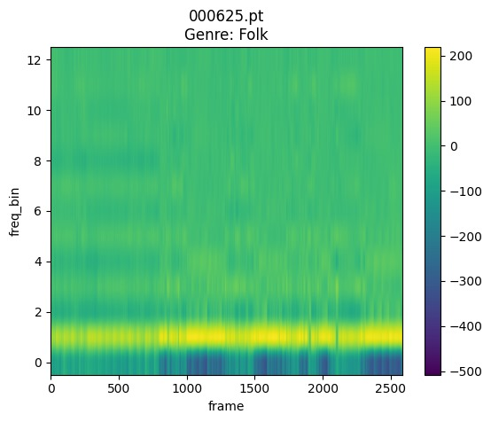
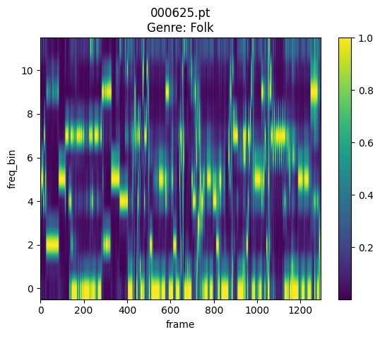
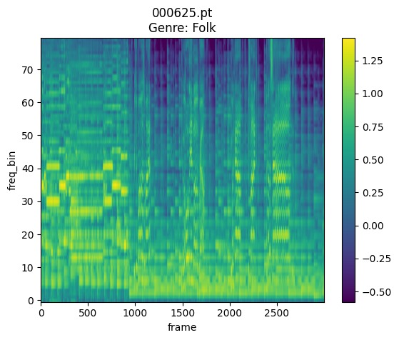
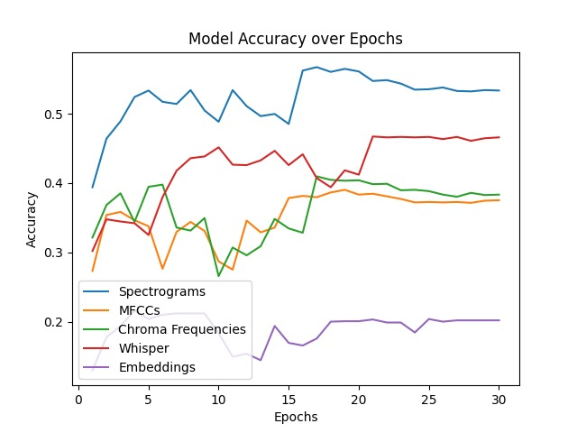
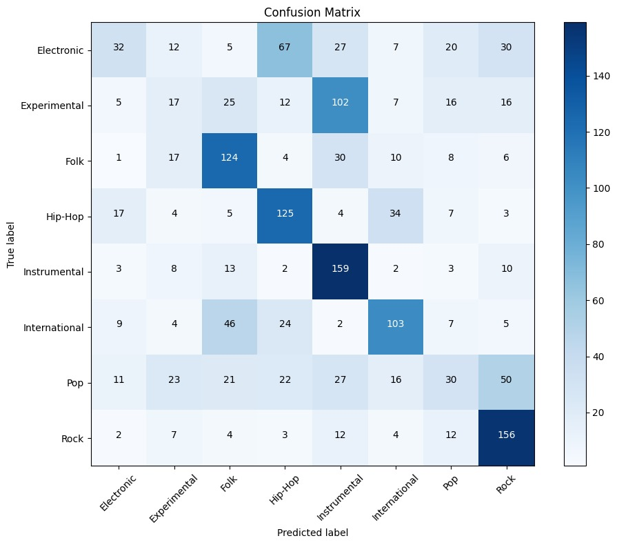
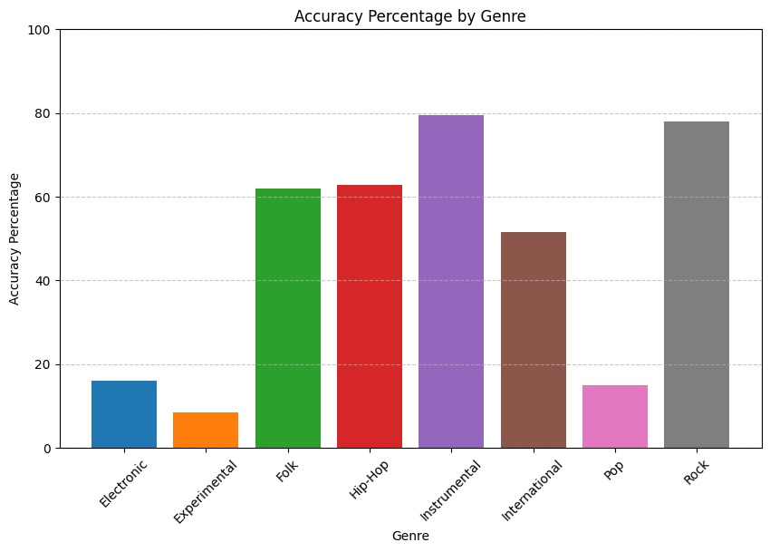

# Music Genre Classification

## Explicació de la data
### MFCCS
Els MFCCs o Coeficients Cepstrales en les Frecuencias de Mel ens mostren imatges a partir dels espectrogrames que teniem anteriorment. En aquest cas, però, els MFCCs apliquen una sèrie de transofrmades per obtenir unes dades més compactes on la tonalitat i el timbre de cada frame del track obté més importància.

<p align="center">

</p>

### Chroma Features
En el cas dels Chroma Features des d'un inici el càlcul es diferents ja que aquests no aprteixen d'una escala mel. Els gràfic Chroma mostren quines notes tenen més pes a cada frame del track. D'aquesta manera podem veure tant les notes concretes com dades derivades d'aquestes: els acords, les harmonies, etc.

<p align="center">

</p>

### Whisper
La inteligència artificial Whisper es fa servir particularment per a passar d'audio a paraules. Això ho fa per mitjà d'un encoder que parteix d'espectrogrames de mel i els transofrma. Tot seguit aplica un decoder que acaba obtenint el text que conté l'audio. En el nostre treball només hem utilitzat aquest encoder que ens permet transofrmar el espectrogrames de mel fent ús de convolucions, capes transformadores i altres encoders com el sinusoidal. La gràcia d'aquesta eina, és que ha sigut entrenada amb més de 680.000 hores i és molt fiable a la hora de detectar paraules en l'àudio, per tant hem pensat que seria una bona idea fer servir els seus espectrogrames transformats.

<p align="center">

</p>

## Estructura del codi
1. models.py : Es defineixen varies arquitectures de xarxes neuronals usant 'torch.nn'. Aquesta consta de tres classes.
2. models_utils.py: Col·lecció de funcions que modifiquen paràmetres d'inicialització dels models i retornen informació del model i també de mètriques.
3. utils.py : És una col·lecció de funcions i classes que realitzen diverses tasques relacionades amb el processament de dades per un model de classificació de gèneres de música usant espectogrames d'àudio.
4. download_data.py : Crea un directori anomenat "data" si no existeix, descarrega i extreu dos fitxers zip ("fma_metadata.zip" i "fma_small.zip") d'una URL proporcionada i realitza altres operacions per organitzar els fitxers descarregats dins del directori "data".
5. environment.yml : Arxiu de configuració en YAML que descriu un entorn conda amb el nom "xnap_example".
6. main.py : Realitza el procés d'entrenament mitjançant la crida a altres mains situats a la carpeta mains i prova d'un model de xarxa neuronal convolucional per a la classificació de gèneres musicals utilitzant dades d'espectrogrames. També utilitza la plataforma WandB per al seguiment i la visualització. Si no estan ja creats, també utilitza funcions de utils.py per crear els espectrogrames.
   6.1 main_spectrogrames : És cridat pel main.py i en cas de que es vulgui fer un entrenament del model només a partir dels espectrogrames pot ser executat directament. 
   6.2 main_mfccs.py : És cridat pel main.py i en cas de que es vulgui fer un entrenament del model només a partir dels mfccs pot ser executat directament.
   6.3 main_chroma.py : És cridat pel main.py i en cas de que es vulgui fer un entrenament del model només a partir dels chroma features pot ser executat directament.
   6.4 main_whisper.py : És cridat pel main.py i en cas de que es vulgui fer un entrenament del model només a partir dels espectrogrames mel modificats amb la IA whisper pot ser executat directament.
7. train.py : Defineix un procés d'entrenament per a un model de xarxa neuronal, calcula les pèrdues per a cada lot d'entrenament i les registra en el registre de WandB per al seguiment i la visualització.
8. test.py : Defineix el procés de testeig per a un model de xarxa neuronal que es realitzarà a cada època, igual que en el fitxer train, es calculen les mètriques pertinents i es registren al WandB.
9. pre_trained_models : Carrega un model ja entrenat i realitza una predicció sobre les dades passades. Està pensat per ser utilitzat per dades no vistes (ni en el train ni en el test, d'altres cançons que com per exemple del "fma_medium.zip"). Per ara dona la predicció d'un set de test del dataset original, caldria descarregar un nou dataset i treballar amb ell.
10. whisper_loader.py : Carrega i preprocessa les dades fent servir el processador de Whisper.

Abans d'executar el codi cal crear un entorn local amb conda i activar-lo. El fitxer [environment.yml] conté totes les dependències necessàries per a poder executar el codi adequadament. Per activar-lo cal executar ``conda env create --file environment.yml``.

```
conda activate xnap_example
```
Per executar un model:
```
python main.py
python main_spectrograms.py
python main_chroma.py
...
```

## Resultats
Les següents imatges mostren una taula amb els resultats dels models individuals per a cada tipus de dada, els resultats per al model que utilitza els embeddings i els resultats per als models que utilitzen l'encoding amb Majority Voting, Higher Mean Probability i Confidence, i un gràfic de l'accuracy al llarg de 30 èpoques per als models que no contenen ensembling.
| Model | Presicion | Recall | F1 Score | Accuracy |
| --- | --- | --- | --- | --- | 
| Espectrogrames | 55 | 55 | 55 | 55 |
| MFCCs | 40 | 39 | 39 | 39 |
| Chroma Features | 42 | 41 | 41 | 41 |
| Whisper | 46 | 47 | 46 | 47 |
| Embeddigns | 3 | 13 | 4 | 20 |
| Majority Voting | 57 | 57 | 57 | 57 |
| Higher Mean Probability | 49 | 49 | 49 | 49 |
| Confidence | 53 | 54 | 53 | 57 |

<p align="center">

</p>


## Matrius de confusió

<p align="center">

</p>

## Conclusions
La implementació de noves maneres d'audio processing ha permés una molt lleugera millora dins del model a la hora d'aplicar un ensembling. L'accruacy pràcticament no ha crescut però hi ha hagut una millora del 1%. Per altra banda, podem dir que un 57% d'accuracy, per molt que sigui una millora respecte l'Starting Point, no és un resultat satisfactori. Això és possiblement degut al dataframe utilitzat en si. Si ens fixem en la primera imatge a continuació, podem veure un plot d'embeddings de dues dimensions del model de l'Starting Point i podem deduïr què provoca les males prediccions del nostre model d'una forma visual. En la imatge podem veure com alguns gèneres queden identificats de forma més clara en forma de clústers: Folk, Hip-Hop, Instrumental, Rock; mentre que d'altres queden repartits de forma pràcticament homogènia a la gràfica: Electronic, Experimental, Pop. Clarament, quant més ben definits els clústers, millor serà la predicció feta pel nostre model i això es veu reflexat, tant en la matriu de confusió mostrada a dalt com en el histograma que es mostra més avall en aquest apartat.

<p align="center">

</p>

<p align="center">

</p>

Possiblement, afegint mecanismes d'atenció dins de l'arquitectura del model inicial podem millorar l'accuracy. Una altra opció seria fer servir el text de les cançons com a data per a treure prediccions a partir de l'arquitectura completa del Whisper. També, veient que els gèneres que generen dificultats són precisament els que més ens costaria distingir a les persones, potser caldria utilitzar data processing que no contingui l'escala mel. Sigui com sigui, mentre el dataframe contingui gèneres com l'experimental, és bastant probable que la predicció correcta d'aquest gènere en concret sigui dolenta. Això es deu a que aquest gènere no està definit de forma concreta: hi ha rock experimental, folk experimental, etc. Un fet semblant passa amb el pop: el trobem a tots els altres gèneres. Això també es veu reflexat en la confusion matrix.

## Contribuïdors
- Arnau Ortiz Torrent | Email: Arnau.Ortiz@autonoma.cat
- Martí Mussons Marin | Email: Marti.Mussons@autonoma.cat
- Eloi Aranda Zampa   | Email: Eloi.Aranda@autonoma.cat

Xarxes Neuronals i Aprenentatge Profund
Computational Mathematics & Data analyitics, 
UAB, 2024
